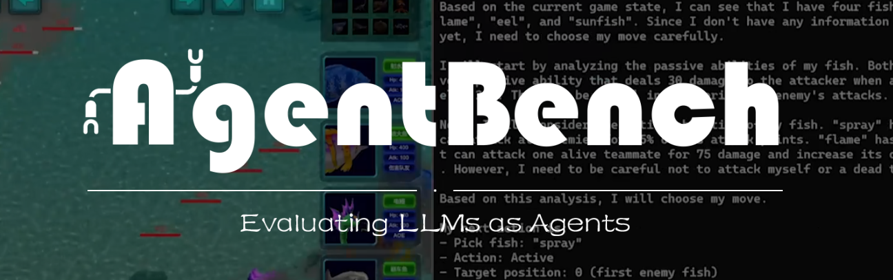
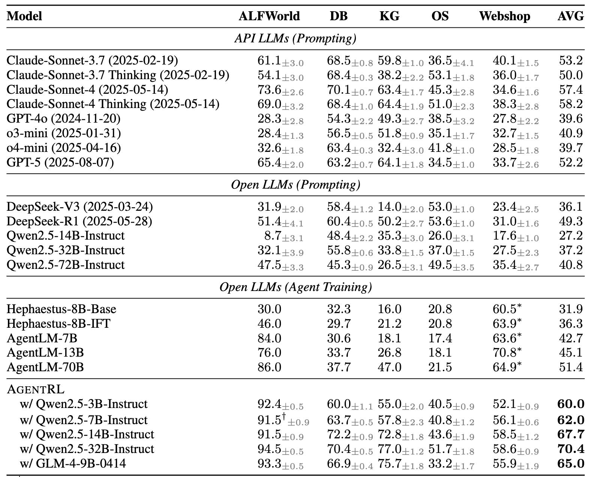
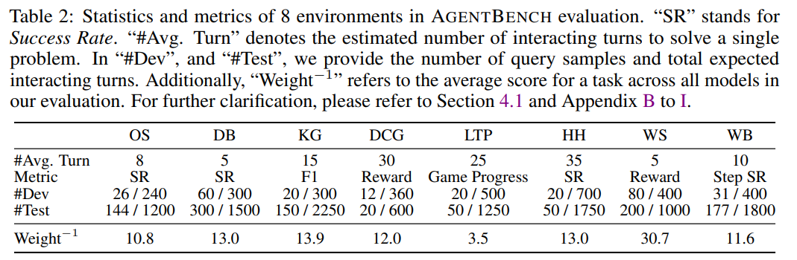
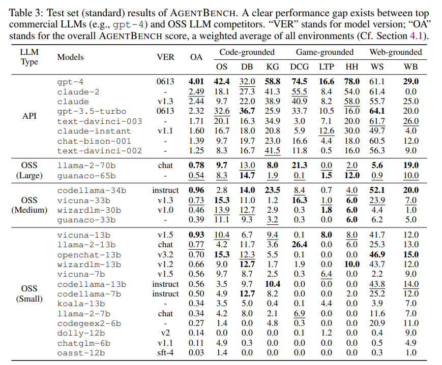
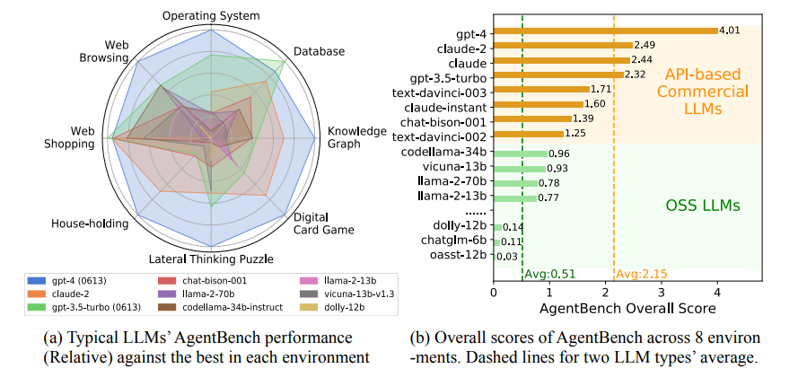

# AgentBench



<p align="center">
   <a href="https://docs.google.com/spreadsheets/d/e/2PACX-1vRR3Wl7wsCgHpwUw1_eUXW_fptAPLL3FkhnW_rua0O1Ji_GIVrpTjY5LaKAhwO-WeARjnY_KNw0SYNJ/pubhtml" target="_blank">🌐 Leaderboard (new)</a> | <a href="https://twitter.com/thukeg" target="_blank">🐦 Twitter</a> | <a href="mailto:agentbench@googlegroups.com">✉️ Google Group</a> | <a href="https://arxiv.org/abs/2308.03688" target="_blank">📃 Paper </a>
</p>

<p align="center">
👋 Join our <a href="https://join.slack.com/t/agentbenchcol-huw1944/shared_invite/zt-20ixabcuv-31cFLBAkqGQxQkJqrWVEVg" target="_blank">Slack</a>  for <i>Q & A</i> or <i><b>collaboration</b> on next version of AgentBench</i>!
</p>

## 🔥[2025.10.10] Introducing **AgentBench FC (Function Calling)** based on [AgentRL](https://github.com/THUDM/AgentRL)

The current repository contains the function-calling version of AgentBench, integrated with [AgentRL](https://github.com/THUDM/AgentRL), an end-to-end multitask and mutliturn LLM Agent RL framework.
If you wish to use the older version, you can revert to [v0.1](https://github.com/THUDM/AgentBench/tree/v0.1) and [v0.2](https://github.com/THUDM/AgentBench/tree/v0.2).

Comparing to the original AgentBench, this version uses a function-calling style prompt,
and adds fully-containerized deployment support for the following tasks:

- `alfworld` (AF)
- `dbbench` (DB)
- `knowledgegraph` (KG)
- `os_interaction` (OS)
- `webshop` (WS)

### Quick Start

We support a quick one-command setup for all the above tasks using Docker Compose.

Before starting, please download or build the following Docker images required by the tasks:

```shell
# dbbench
docker pull mysql:8

# os_interaction
docker build -t local-os/default -f ./data/os_interaction/res/dockerfiles/default data/os_interaction/res/dockerfiles
docker build -t local-os/packages -f ./data/os_interaction/res/dockerfiles/packages data/os_interaction/res/dockerfiles
docker build -t local-os/ubuntu -f ./data/os_interaction/res/dockerfiles/ubuntu data/os_interaction/res/dockerfiles
```

To run the KG freebase server, you will also need a copy of the data found [here](https://github.com/dki-lab/Freebase-Setup).
Download, extract and place the data at `./virtuoso_db/virtuoso.db` (or modify `extra/docker-compose.yml` and set the mount point to your data location).

Then, you can bring up the stack with:

```shell
docker compose -f extra/docker-compose.yml up
```

This command will download or build the necessary Docker images and start the following services in Docker:

- AgentRL Controller
- `alfworld` task worker (x1, increase as needed)
- `dbbench` task worker (x1, increase as needed)
- `knowledgegraph` task worker (x1, increase as needed)
- `os_interaction` task worker (x1, increase as needed)
- `webshop` task worker (x1, increase as needed)
- freebase server (for `knowledgegraph` task)
- Redis server (for container allocation)

If your machine already has Redis (version 7+) running, you can omit the Redis service from the `docker-compose.yml`.

> [!WARNING]  
> Please note that the `webshop` environment requires ~16GB of RAM to start,
> and the current implementation of `alfworld` leaks memory and disk space until the task worker is restarted.
> Make sure your machine has sufficient resources before running.

### Benchmarking Results

We report the results of various models on the test set of AgentBench FC.



Please see our [Leaderboard](https://docs.google.com/spreadsheets/d/e/2PACX-1vRR3Wl7wsCgHpwUw1_eUXW_fptAPLL3FkhnW_rua0O1Ji_GIVrpTjY5LaKAhwO-WeARjnY_KNw0SYNJ/pubhtml) for full results.
Please contact [agentbench_fc&#64;googlegroups.com](mailto:agentbench_fc@googlegroups.com) if you have any questions or would like to contribute your results.

---

## 🔥[2024.08.13] Introducing [VisualAgentBench](https://github.com/THUDM/VisualAgentBench)

VisualAgentBench is designed for evaluating and training visual foundation agents based on large multimodel models (LMMs). We introduce 5 distinct environments spanning 

* Embodied: VAB-OmniGibson, VAB-Minecraft
* GUI: VAB-Mobile, VAB-WebArena-Lite
* Visual Design: VAB-CSS

to systematically benchmark 17 LMMs (proprietary & open LMMs). We also provide the trajectory dataset for behavior cloning training on open LMMs for you to develop your own visual foundation agents!

---

The following is the introduction to the original AgentBench (v0.2).

# AgentBench: Evaluating LLMs as Agents

https://github.com/THUDM/AgentBench/assets/129033897/656eed6e-d9d9-4d07-b568-f43f5a451f04

**AgentBench** is the first benchmark designed to evaluate **LLM-as-Agent** across a diverse spectrum of different
environments. It encompasses 8 distinct environments to provide a more comprehensive evaluation of the LLMs' ability to
operate as autonomous agents in various scenarios. These environments include 5 freshly created domains, namely

-   Operating System (OS)
-   Database (DB)
-   Knowledge Graph (KG)
-   Digital Card Game (DCG)
-   Lateral Thinking Puzzles (LTP)

as well as 3 recompiled from published datasets:

-   House-Holding (HH) ([ALFWorld](https://github.com/alfworld/alfworld))
-   Web Shopping (WS) ([WebShop](https://github.com/princeton-nlp/webshop))
-   Web Browsing (WB) ([Mind2Web](https://github.com/OSU-NLP-Group/Mind2Web))


## Table of Contents

-   [Dataset Summary](#dataset-summary)
-   [Leaderboard](#leaderboard)
-   [Quick Start](#quick-start)
-   [Next Steps](#next-steps)
-   [Citation](#citation)

## Dataset Summary

We offer two splits for each dataset: Dev and Test. The multi-turn interaction requires an LLMs to generate around 4k
and 13k times respectively.



## Leaderboard

Here is the scores on test set (standard) results of AgentBench.



While LLMs begin to manifest their proficiency in LLM-as-Agent, gaps between models and the distance towards practical
usability are significant.



## Quick Start

This section will guide you on how to quickly use gpt-3.5-turbo-0613 as an agent to launch the `dbbench-std` and `os-std` tasks.
For the specific framework structure, please refer to [Framework Introduction](docs/Introduction_en.md).
For more detailed configuration and launch methods, please check [Configuration Guide](docs/Config_en.md)
and [Program Entrance Guide](docs/Entrance_en.md).

### Step 1. Prerequisites

Clone this repo and install the dependencies.

> **Python version note:** AgentBench pins older scientific Python deps (e.g. `numpy~=1.23.x`).
> Using the recommended **Python 3.9** (via conda) is the most reliable way to install dependencies.

```bash
cd AgentBench
conda create -n agent-bench python=3.9
conda activate agent-bench
pip install -r requirements.txt
```

Ensure that [Docker](https://www.docker.com/) is properly installed.

```bash
docker ps
```

Build required images for `dbbench-std` and `os-std`.

```bash
docker pull mysql
docker pull ubuntu
docker build -f data/os_interaction/res/dockerfiles/default data/os_interaction/res/dockerfiles --tag local-os/default
docker build -f data/os_interaction/res/dockerfiles/packages data/os_interaction/res/dockerfiles --tag local-os/packages
docker build -f data/os_interaction/res/dockerfiles/ubuntu data/os_interaction/res/dockerfiles --tag local-os/ubuntu
```

### Step 2. Configure the Agent

Fill in your OpenAI API Key at the correct location in `configs/agents/openai-chat.yaml`. (e.g. `gpt-3.5-turbo-0613`)

You can try using `python -m src.client.agent_test` to check if your agent is configured correctly.

By default, `gpt-3.5-turbo-0613` will be started. You can replace it with other agents by modifying the parameters:

```bash
python -m src.client.agent_test --config configs/agents/api_agents.yaml --agent gpt-3.5-turbo-0613
```

### Step 3. Start the task server

Starting the task worker involves specific tasks. Manual starting might be cumbersome; hence, we provide an automated
script.

The assumption for this step is that ports from 5000 to 5015 are available. For Mac OS system, you may want to follow [here](https://stackoverflow.com/questions/69955686/why-cant-i-run-the-project-on-port-5000) to free port 5000 to use.

```bash
python -m src.start_task -a
```

This will launch five task_workers each for `dbbench-std` and `os-std` tasks and automatically connect them
to the controller on port 5000. **After executing this command, please allow approximately 1 minute for the task setup to complete.** If the terminal shows ".... 200 OK", you can open another terminal and follow step 4.

#### Lite preset (laptops / limited RAM)

If you want to start with minimal concurrency (1 worker per task), use the lite preset:

```bash
python -m src.start_task -a --config configs/start_task_lite.yaml
```

### Step 4. Start the assigner

This step is to actually start the tasks.

If everything is correctly configured so far, you can now initiate the task tests.

```bash
python -m src.assigner
```

If you started the task server with the lite preset, you can also run the lite evaluation preset:

```bash
python -m src.start_task -a --config configs/start_skill_task_os.yaml
python -m src.skill_cycle --config configs/skill_cycle_os.yaml --run-name run_001 --force
```

The OS skill-cycle config is set to use `http://localhost:5040/api` as the controller.

### Skill-cycle (ALFWorld) quick start

Pull the ALFWorld Docker image first (requires network access):

```bash
docker pull longinyu/agentbench-alfworld
```

Start the task worker on `5060+` (avoids conflicts with OS and LTP workers):

```bash
python -m src.start_task -a --config configs/start_skill_task_alfworld.yaml --controller-port 5060 --base-port 5061
```

Then in a separate terminal run the skill-learning cycle:

```bash
python -m src.skill_cycle --config configs/skill_cycle_alfworld.yaml --run-name run_001 --force
```

The ALFWorld skill-cycle uses a stratified 60/40 split of `data/alfworld/standard.json` (30 dev + 20 val samples covering all 6 task types).

### Skill base directories

Each benchmark has its own skill base directory (`skills/<benchmark>/base/`) that is read-only during a run. The skill cycle writes learned skills to `<run_dir>/skills/learned/` instead — the base directory is never modified by training.

All base directories ship with only a single `skeleton.md` file, which is a read-only template that defines the required structure for learned skills (it is never injected into the agent). The exception is:

**DBBench Prompt Modifications**
We have modified the original DBBench environment prompt (`src/server/tasks/dbbench/__init__.py`) to resolve contradictory formatting instructions. The original prompt instructed the agent to output lists for modification tasks while simultaneously stating the answer field could be "anything". This forced the skill-learning framework to waste cycles learning benchmark-specific formatting hacks rather than generalized SQL skills. The revised prompt enforces strict, deterministic formatting for all actions, maintaining the benchmark-agnostic goals of the skill agent.

**OS Interaction** (`skills/os/base/`) additionally contains `task_type_classifier.md`, a manually authored base skill that fires on every OS task. OS tasks are uniquely ambiguous between two fundamentally different task types — *execute and report* (run commands, return the observed value) and *write a command/script* (output the command text as the answer). This ambiguity cannot be resolved by the skill-learning loop because it requires semantic task-level classification rather than a behavioural correction. Adding it as a permanent base skill ensures the agent classifies the task type before taking its first action on every episode. All other benchmarks are run with their base directories unchanged (skeleton only).

### Skill-cycle (Mind2Web) quick start

Pull the Mind2Web Docker image first (requires network access):

```bash
docker pull longinyu/agentbench-mind2web
```

Start the task worker on `5070+` (avoids conflicts with OS, LTP, Card Game, DBBench, and ALFWorld workers):

```bash
python -m src.start_task -a --config configs/start_skill_task_mind2web.yaml --controller-port 5070 --base-port 5071
```

**Note:** the Mind2Web image takes ~5 minutes to initialise. Wait until the terminal shows `... 200 OK` before continuing.

Then in a separate terminal run the skill-learning cycle:

```bash
python -m src.skill_cycle --config configs/skill_cycle_mind2web.yaml --run-name run_001 --force
```

The Mind2Web skill-cycle uses a 300/150/162 split of the first 612 flattened actions from the `test_domain` set (912 annotation_ids → ~5,911 actions after flattening). Indices 0–299 are used for skill learning, 300–449 for validation, and 450–611 are held out for final eval. Success is measured by step success rate: the agent must select the correct DOM element **and** produce a perfect-F1 action string. Learned skills are written to `skills/mind2web/base/`.

### Skill-cycle internals

The skill cycle (`src/skill_cycle.py`) runs an iterative learning loop:

1. **Run dev samples** in batches of `update_every`. After each batch, call `_grpo_skill_update`.
2. **GRPO skill update**: generate `grpo_k` candidate skill proposals, probe each on `grpo_eval_n` samples (`grpo_eval_n/2` currently-failing + `grpo_eval_n/2` currently-passing), pick the proposal with the highest net score (fixes − regressions). Apply only if best net > 0.
3. **Failure taxonomy**: before proposing, the agent classifies failing samples into named failure modes via `classify_failures`. This taxonomy is passed to `diagnose` → `propose` to give the proposer structured context. The taxonomy is accumulated across batches within the epoch and carried into the next epoch.
4. **Validation**: run all val samples after each epoch; record val score.
5. **Best-checkpoint management**: save `skills/learned/` → `skills/best/` whenever val improves. After training ends, restore `best/` as the final checkpoint. The best checkpoint is **not** restored before each epoch — training continues from the current state, and the best checkpoint is only applied at the very end.
6. **NOT_AVAILABLE retry**: if the task server returns `NOT_AVAILABLE` (all worker slots full), `_run_single` retries indefinitely with up to 30 s between attempts. This is common under concurrent OS load (Docker container spin-up latency). The sample is never silently dropped as incorrect.

#### Data splits

Each benchmark ships with pre-computed splits produced by `data/<benchmark>/split_dataset.py`:

| Benchmark | Dev (skill learning) | Val (monitoring) | Test (held-out) |
|-----------|---------------------|-----------------|----------------|
| OS        | 79 samples (60% of worlds 1–5, 7) | 56 samples | — |
| DBBench   | 176 samples (60% of standard.jsonl, stratified by type) | 124 samples | 60 samples (dev.jsonl) |
| ALFWorld  | 30 samples (6 task types × ~5) | 20 samples | 20 samples (dev.json) |
| Mind2Web  | 300 samples (indices 0–299) | 150 samples (indices 300–449) | 162 samples (indices 450–611) |
| Card Game | 80 samples (20 reps × 4 combos) | 60 samples (15 reps × 4 combos) | 60 samples (15 reps × 4 combos) |

**ALFWorld split note**: samples are assigned IDs matching their position in the task's `data_files` list (JSON insertion order from `standard.json`). The split script iterates in insertion order — not alphabetical order — so IDs are consistent with what `AlfWorldTask.get_indices()` returns.

**DBBench split note**: the dev set contains only real `standard.jsonl` entries. Synthetic aggregation samples (IDs ≥ 10000) were removed because they always fail with `START_FAILED` (the task server indexes by position in the dataset, and those IDs are out of bounds).

## Next Steps

If you wish to launch more tasks or use other models, you can refer to the content
in [Configuration Guide](docs/Config_en.md) and [Program Entrance Guide](docs/Entrance_en.md).

For the environment of the remaining five tasks, you will need to download the Docker images we provide.

```
longinyu/agentbench-ltp
longinyu/agentbench-webshop
longinyu/agentbench-mind2web
longinyu/agentbench-card_game
longinyu/agentbench-alfworld
```

The resource consumption of a single task_worker for the eight tasks is roughly as follows; consider this when
launching:

| Task Name | Start-up Speed | Memory Consumption |
| --------- | -------------- | ------------------ |
| webshop   | ~3min          | ~15G               |
| mind2web  | ~5min          | ~1G                |
| db        | ~20s           | < 500M             |
| alfworld  | ~10s           | < 500M             |
| card_game | ~5s            | < 500M             |
| ltp       | ~5s            | < 500M             |
| os        | ~5s            | < 500M             |
| kg        | ~5s            | < 500M             |


### Deploy the KnowledgeGraph service loacally
the KnowledgeGraph task depends on an online service which now is not stable, if you want to deploy the service locally, you can follow steps below:

**step1.** <br />
download the database and setup the service [freebase-setup](https://github.com/dki-lab/Freebase-Setup).


**step2.** <br />
change this line `sparql_url: "http://164.107.116.56:3093/sparql"` to `sparql_url: "<your service api of sparql>"` in `/configs/tasks/kg.yaml`.

**P.S.** you should start your KG service before you start the agent tasks services.

## Extending AgentBench

If you wish to add new tasks to AgentBench, you may refer to [Extension Guide](docs/Extension_en.md).

## References

Avalon task is merged from [AvalonBench](https://github.com/jonathanmli/Avalon-LLM/), which implements a multi-agent framework.

## Citation

```
@article{liu2023agentbench,
  title   = {AgentBench: Evaluating LLMs as Agents},
  author  = {Xiao Liu and Hao Yu and Hanchen Zhang and Yifan Xu and Xuanyu Lei and Hanyu Lai and Yu Gu and Hangliang Ding and Kaiwen Men and Kejuan Yang and Shudan Zhang and Xiang Deng and Aohan Zeng and Zhengxiao Du and Chenhui Zhang and Sheng Shen and Tianjun Zhang and Yu Su and Huan Sun and Minlie Huang and Yuxiao Dong and Jie Tang},
  year    = {2023},
  journal = {arXiv preprint arXiv: 2308.03688}
}
```

## Local Benchmark Modifications (skill-agent-dev)

* **DBBench**: Removed the arbitrary list format requirement for Type A/B classification to allow accurate skill learning.
* **OS Interaction**: Checked against THUDM/AgentBench upstream upstream logic. Removed customized Type A/B/C classification bloat (execute-and-report, generate-artifact, static-knowledge) left over from development experiments so that it aligns closely with the original repository. This eliminates the 'Protocol Distraction' issue that prevented pure bash learning.
