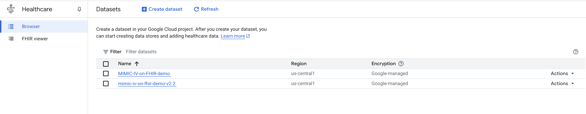
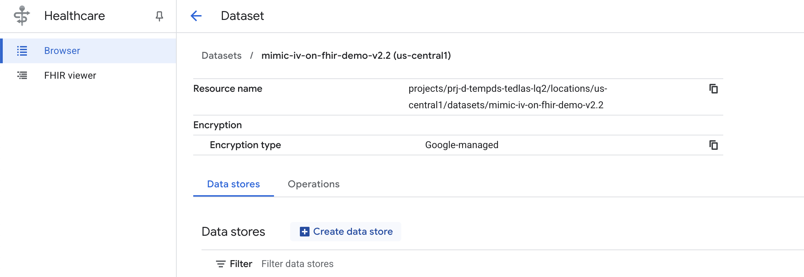
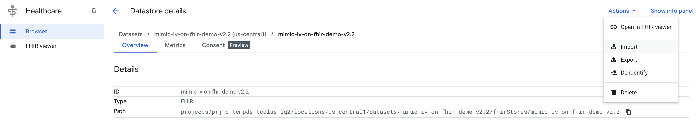
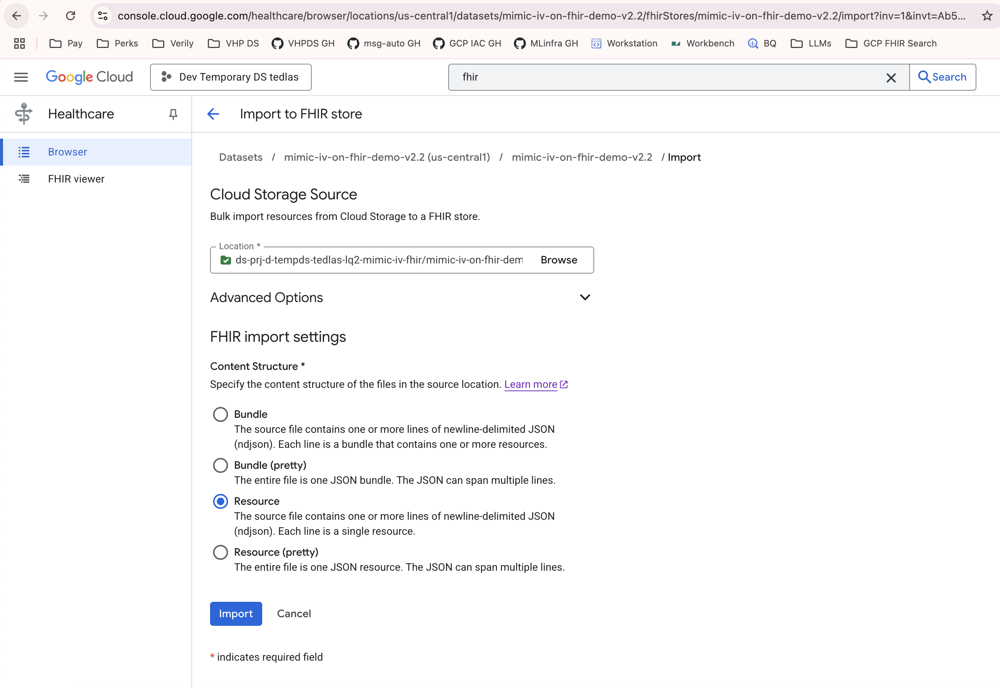

# FHIR-AgentBench

This repository contains the code and dataset for FHIR-AgentBench.


## 📁 Project Structure

```
FHIR-AgentBench/
├── scripts/                          # Bash scripts for data setup, agent inference, and evaluation
├── agent/                            # Multiple agent implementations
├── tools/                            # Tools for agents
├── utils/                            # Utility modules
├── config.py                         # Configuration settings and constants
├── config.yml                        # YAML configuration file
├── create_db.py                      # Creates database for Q&A conversion to FHIR
├── create_question_answer_dataset.py # Creates Q&A dataset from EHRSQL
├── create_question_fhir_dataset.py   # Creates FHIR-compatible question dataset
├── evaluation_metrics.py             # Main evaluation script
├── fhir_client.py                    # FHIR client for Google Cloud Healthcare API
├── run_agent.py                      # Main script to run agents on datasets
├── question_fixes_complete.json      # Hard-coded question fixes
├── value_mapping_valid_natural.json  # Natural language value mappings 
├── requirements.txt                  # Python package dependencies
└── images/                           # Documentation images
```

## 🚀 Getting Started

### Prerequisites

- Install required packages:
  ```bash
  # Create a conda environment
  conda create -n fhir-agentbench python=3.11
  conda activate fhir-agentbench

  # Install dependencies
  pip install -r requirements.txt
  ```

### Data Preparation

#### 1. Upload the MIMIC-IV FHIR data to a GCP FHIR store
- Download [MIMIC-IV Clinical Database Demo on FHIR](https://physionet.org/content/mimic-iv-fhir-demo/2.1.0/) from PhysioNet and extract the .gz files.
- Create a GCP account, then in the [Google Cloud Console](https://console.cloud.google.com) search for FHIR Viewer.
- Click Browser on the left, then Create dataset.

- Next, click Create data store to prepare for the data upload.

- For Configure your FHIR store, select R4 as the FHIR Version. Keep other settings as default and click Create.
- Separately, in [Cloud Storage](https://console.cloud.google.com/storage), upload your unzipped folder containing the MIMIC-IV FHIR data (*.ndjson) to a bucket.
- Back in the FHIR store, click Actions in the upper right and choose Import.

- Select the folder you uploaded. Under FHIR Import Settings, choose Resource for Content Structure. Click Import and grant permissions if prompted.

- Open the Import operation to confirm success. It usually completes in about 10 minutes.

#### 2. Enable APIs and authenticate with gcloud

You can enable the required APIs and verify access using the [gcloud CLI](https://cloud.google.com/sdk/docs/install-sdk). This is often the fastest way to confirm your setup before running code.

0) Log in

   ```bash
   # Authenticate with your Google account
   gcloud auth login

   # Set up Application Default Credentials (ADC)
   gcloud auth application-default login --no-launch-browser
   ```

1) Check or set the current project and project number

   ```bash
   # List all available projects to find your PROJECT_ID
   gcloud projects list
   ```

   ```bash
   # Set the quota project for ADC (to handle billing and quotas)
   gcloud auth application-default set-quota-project <YOUR_PROJECT_ID>

   # Set the default project for gcloud CLI
   gcloud config set project <YOUR_PROJECT_ID>
   ```

   ```bash
   # Get the current project ID and project number
   PROJECT_ID="$(gcloud config get-value project)"
   PROJECT_NUMBER="$(gcloud projects describe "$PROJECT_ID" --format="value(projectNumber)")"

   # Print them for confirmation
   echo "$PROJECT_ID"
   echo "$PROJECT_NUMBER"
   ```

2) Enable required APIs

   ```bash
   # Enable the Cloud Healthcare API (for FHIR, DICOM, HL7v2 resources)
   gcloud services enable healthcare.googleapis.com --project="$PROJECT_ID"

   # Enable the Cloud Asset API (needed for dataset and store discovery)
   gcloud services enable cloudasset.googleapis.com --project="$PROJECT_ID"

   # Enable the Cloud Resource Manager API (needed for project and resource management)
   gcloud services enable cloudresourcemanager.googleapis.com --project="$PROJECT_ID"

   # Enable the Service Usage API (needed to enable and check other APIs)
   gcloud services enable serviceusage.googleapis.com --project="$PROJECT_ID"
   ```

3) Automatically discover dataset, FHIR store, and location

   ```bash
   # Find the dataset ID and location
   read DATASET_ID LOCATION <<<$(gcloud asset search-all-resources \
   --scope="projects/$PROJECT_NUMBER" \
   --asset-types="healthcare.googleapis.com/Dataset" \
   --format="value(name.basename(), location)")

   echo "LOCATION=$LOCATION"
   echo "DATASET_ID=$DATASET_ID"

   # Find the FHIR store ID
   STORE_ID="$(gcloud healthcare fhir-stores list \
   --dataset="$DATASET_ID" --location="$LOCATION" --project="$PROJECT_ID" \
   --format="value(name.basename())")"

   echo "STORE_ID=$STORE_ID"
   ```

4) Grant IAM permissions to your user (if not already granted)

   ```bash
   # Get the current logged-in user
   USER="$(gcloud config get-value account)"

   # Grant FHIR resource read access
   gcloud healthcare datasets add-iam-policy-binding "$DATASET_ID" \
   --location="$LOCATION" --project="$PROJECT_ID" \
   --member="user:$USER" \
   --role="roles/healthcare.fhirResourceReader"

   # Grant FHIR store viewer access
   gcloud healthcare datasets add-iam-policy-binding "$DATASET_ID" \
   --location="$LOCATION" --project="$PROJECT_ID" \
   --member="user:$USER" \
   --role="roles/healthcare.fhirStoreViewer"
   ```

5) Project configuration

   Create a file named config.yml in the project root:

   ```yaml
   OPENAI_API_KEY: "your-api-key"
   GEMINI_API_KEY: "your-api-key"
   FHIR_CONFIG:
      PROJECT_ID: "your-gcp-project-id"
      LOCATION: "your-fhir-dataset-location"
      DATASET_ID: "your-dataset-id"
      STORE_ID: "fhir-store-id (usually the same as dataset_id)"
   ```

#### 3. (Optional) Run the script to download and prepare the dataset:
If `final_dataset/questions_answers_sql_fhir.csv` already exists, you can skip this stage.

   ```bash
   bash scripts/setup_data.sh
   python create_question_answer_dataset.py
   python create_question_fhir_dataset.py
   ```

## Environment variables

The model backend is chosen at run time with `--agent <preset>`; each preset
reads its credentials/endpoint from environment variables. See
[configs/agents/README.md](configs/agents/README.md) for the full list. For example:

```bash
# gptoss / deepseek / local — self-hosted, OpenAI-compatible
export OSS_API_BASE="http://localhost:8000/v1"

# gemini — Vertex AI (FHIR data access also uses GCP)
export GOOGLE_CLOUD_PROJECT="my-project"; gcloud auth application-default login

# gpt4 — Azure OpenAI
export AZURE_API_KEY="..." AZURE_API_BASE="https://YOUR-RESOURCE.openai.azure.com" AZURE_API_VERSION="2024-12-01-preview"

# gpt5 — Azure OpenAI v1 endpoint
export AZURE_OPENAI_API_KEY="..." AZURE_OPENAI_BASE_URL="https://YOUR-RESOURCE.openai.azure.com/openai/v1/"
```

## Running experiments

No separate task worker is needed — each cycle script connects directly to the GCP FHIR API.

Run all six methods for one model backend with the helper script at the repo root:

```bash
conda activate fhir-agentbench
./run_all.sh gptoss        # or deepseek / gemini / gpt4 / gpt5 / local
```

The backend is selected with `--agent` (or `GRASP_BACKEND`, or a config's
`agent_preset:`); see [configs/agents/README.md](configs/agents/README.md) for
the presets and the environment variables each needs. Any config below can be
run with `--agent <backend>` to override its default model.

Alternatively, run individual methods by hand:

```bash
conda activate fhir-agentbench

# One config per method; choose the model with --agent (gptoss shown).
python grasp.py              --config configs/grasp.yaml              --run-name run_001 --agent gptoss
python memory_cycle.py       --config configs/memory_cycle.yaml       --run-name run_001 --agent gptoss
python batch_memory_cycle.py --config configs/batch_memory_cycle.yaml --run-name run_001 --agent gptoss
python evo_memory_cycle.py   --config configs/evo_memory_cycle.yaml   --run-name run_001 --agent gptoss
python expel_cycle.py        --config configs/expel_cycle.yaml        --run-name run_001 --agent gptoss
python skillx_cycle.py       --config configs/skillx_cycle.yaml       --run-name run_001 --agent gptoss
```

Swap `--agent gptoss` for `deepseek`, `gemini`, `gpt4`, `gpt5`, or `local` to run
another backend; the executing agent, skill/memory writer, and grader switch together.

**Resuming an interrupted run:**

```bash
python grasp.py --config configs/grasp.yaml --run-name run_001 --agent gptoss --resume
```

The `--resume` flag works identically for all six methods.

## Test set evaluation

Test set evaluation runs **automatically** at the end of every cycle using the best-val checkpoint (in-distribution test only). Results are written into the run directory:

```
outputs/<method>/<run-name>/
├── id_test_eval_best/     # in-dist test, best-val checkpoint
│   ├── test_runs.jsonl
│   └── test_score.json    # {split, score, n_correct, n_total}
└── id_test_eval_baseline/ # in-dist test, no-skill baseline (GRASP only)
    ├── test_runs.jsonl
    └── test_score.json
```

## Output structure

```
outputs/
└── grasp_gptoss/
    └── run_001/
        ├── run.log
        ├── val_scores.json
        ├── id_test_eval_best/
        │   ├── test_runs.jsonl
        │   └── test_score.json
        ├── id_test_eval_baseline/
        │   ├── test_runs.jsonl
        │   └── test_score.json
        └── skills/
            ├── learned/
            └── best/
```

## Authorship

FHIR-AgentBench is a joint research effort between Verily Life Sciences, Korea Advanced Institute of Science & Technology (KAIST), and Massachusetts Institute of Technology (MIT).
